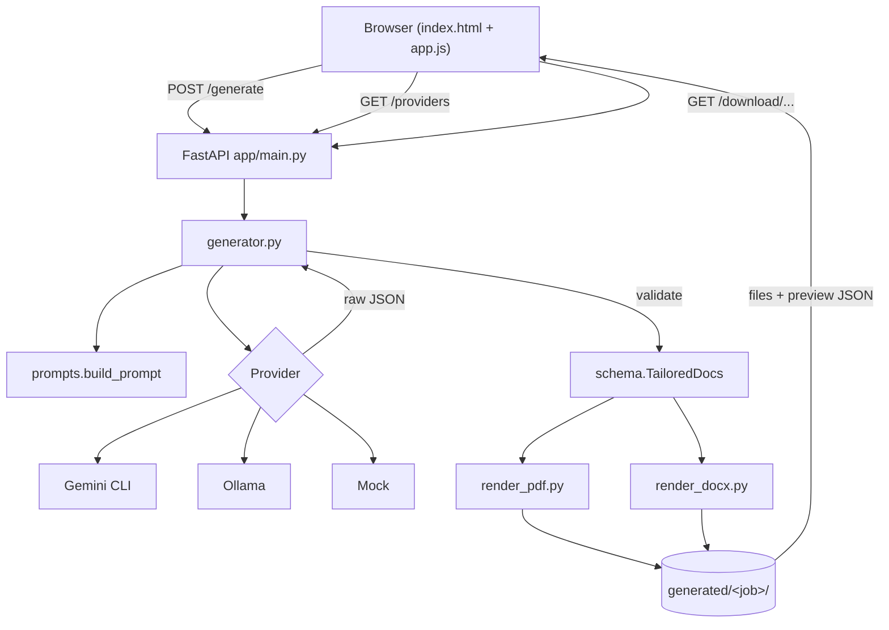

# Architecture — Resume Tailor

## Overview

A small FastAPI web app with a vanilla HTML/CSS/JS frontend. The backend turns
two text inputs into structured data via a pluggable LLM provider, then renders
that data to PDF and Word. There is no database and no build step.



## Components

| Module | Responsibility |
| --- | --- |
| `app/main.py` | FastAPI app, routes, file storage, path-safe downloads. |
| `app/generator.py` | Orchestration: build prompt → call provider → extract & validate JSON → `TailoredDocs`. |
| `app/prompts.py` | The tailoring prompt, JSON contract, and honesty/length rules. |
| `app/schema.py` | pydantic models — the single contract between model output and renderers. |
| `app/providers/` | Provider interface + Gemini CLI, Ollama, Mock implementations + registry. |
| `app/render_pdf.py` | reportlab renderer with one-page auto-fit. |
| `app/render_docx.py` | python-docx renderer (compact typography for one page). |
| `app/templates/index.html` | Single-page form + result UI. |
| `app/static/` | `style.css` (theme) and `app.js` (fetch, render preview, tabs). |

## Layered view

```
            ┌────────────────────────────────────────┐
 Presentation│ index.html · style.css · app.js        │
            └────────────────────────────────────────┘
            ┌────────────────────────────────────────┐
 Web/API    │ main.py  (routes, validation, files)   │
            └────────────────────────────────────────┘
            ┌────────────────────────────────────────┐
 Domain     │ generator.py · prompts.py · schema.py  │
            └────────────────────────────────────────┘
            ┌──────────────────────┬─────────────────┐
 Adapters   │ providers/*          │ render_pdf/docx │
            └──────────────────────┴─────────────────┘
```

The **schema is the seam**: providers must produce JSON that validates as
`TailoredDocs`, and renderers consume only `TailoredDocs`. Neither side knows
about the other.

## Provider abstraction

```python
class LLMProvider(ABC):
    name: str
    label: str
    def is_available(self) -> bool: ...
    def generate(self, prompt: str) -> str: ...   # returns raw text/JSON
    def setup_hint(self) -> str: ...              # shown when unavailable
```

- Real providers shell out via `run_cli(cmd, prompt)` (prompt on **stdin**, so
  length and quoting are never a problem).
- The **registry** (`providers/__init__.py`) maps `name → class`,
  `get_provider(name, model)` instantiates (passing `model` only to engines that
  need it), and `list_providers()` reports availability to the UI.

### Adding a provider (extension point)

1. Create `providers/yourtool.py` with a `LLMProvider` subclass.
2. Register it in `PROVIDERS` (and `_NEEDS_MODEL` if it takes a model).
3. Add a dropdown `<option>` and a hint string in `app.js` `HINTS`.

No other code changes — the generator, schema, and renderers are untouched.

## Dependencies & rationale

| Dependency | Why |
| --- | --- |
| **FastAPI + uvicorn** | Minimal async web framework; `Form`/`HTMLResponse`/`FileResponse` cover every route. |
| **pydantic v2** | Declarative schema + validation = the model-output contract enforced in one place. |
| **reportlab** | Programmatic PDF with flowables; enables the measure-and-shrink one-page loop. |
| **python-docx** | Standard `.docx` generation employers can open and edit. |
| **Jinja2** | Server-render the form with provider availability. |
| **Vanilla JS** | No build toolchain; the frontend is two small static files. |
| **pytest + httpx** | Offline unit/integration tests via `TestClient`. |

## Runtime & configuration

- **Python 3.12** (pydantic-core lacks 3.14 wheels).
- Configuration is environment-only (no config files):
  `GEMINI_CMD`, `GEMINI_MODEL`, `OLLAMA_CMD`, `OLLAMA_MODEL`.
- State is the filesystem: generated files live under `generated/<job-hex>/`.

## Why no database / queue

v1 is a single-user local tool. Generation is synchronous and outputs are
ephemeral files, so a database or task queue would be pure overhead. Those
become relevant only for a hosted, multi-user deployment — see
[TECH_DEBT.md](TECH_DEBT.md) and [SYSTEM_DESIGN.md](SYSTEM_DESIGN.md#scaling).
