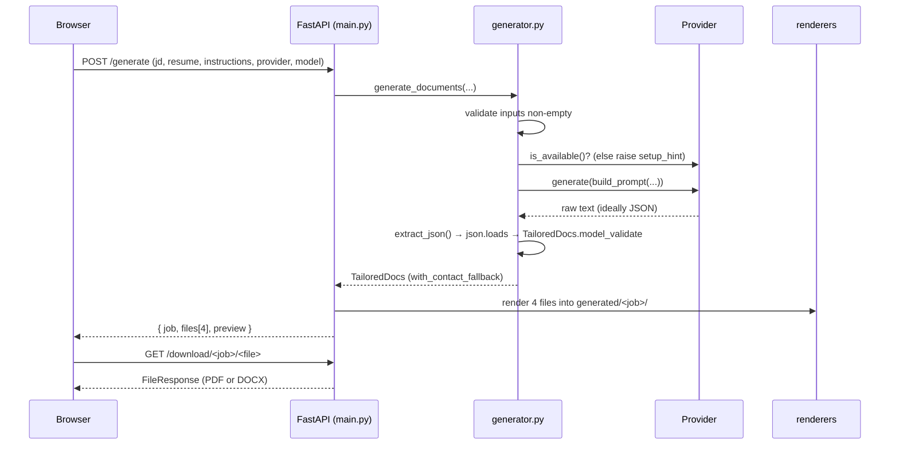

# System Design — Resume Tailor

## Request lifecycle (`POST /generate`)



## Data model (the contract)

`schema.py` defines exactly what an engine must emit and what renderers consume:

```
TailoredDocs
├── resume: ResumeContent
│   ├── contact: Contact { name, email, phone, links[] }
│   ├── summary: str
│   ├── skills:    SkillLine[]      { label, items }
│   ├── experience: ExperienceItem[] { company, title, dates, bullets[] }
│   └── education: str[]
└── cover_letter: CoverLetter
    { date, recipient[], salutation, paragraphs[], closing, signature }
```

`with_contact_fallback()` signs the cover letter with the resume name if the
engine left `signature` blank — a small robustness guarantee.

## Defensive JSON handling

Local models don't always return clean JSON. `generator.extract_json`:

1. Strips a leading ` ```json ` / ` ``` ` fence and a trailing fence.
2. Finds the first `{` and walks forward counting brace depth, **ignoring braces
   inside strings** (tracks quote and escape state), returning the first
   balanced object.

Then `parse_docs` runs `json.loads` and `TailoredDocs.model_validate`, raising a
readable `GenerationError` at each failure point. This keeps a chatty model from
breaking the pipeline.

## One-page enforcement

**PDF (measured auto-fit).** `render_pdf` builds the document to an in-memory
buffer at decreasing scale factors `[1.0 … 0.76]`. After each build it reads
`SimpleDocTemplate.page`; the first scale that yields `page <= 1` wins. This is a
true measure-and-shrink loop, so even a dense resume collapses onto one page
(test: `test_dense_resume_still_one_page`).

**DOCX (budget-based).** python-docx has no layout engine, so one page is
achieved through compact typography plus the prompt's length budgets (summary
≤55 words, ≤16 total bullets, etc.). This asymmetry is a known limitation, noted
in [TECH_DEBT.md](TECH_DEBT.md).

## File storage

- Each run gets `generated/<job>/` where `<job>` is a 32-char hex UUID.
- Filenames are `<slug>_Resume.pdf|.docx` and `<slug>_CoverLetter.pdf|.docx`,
  where `slug` is the candidate name reduced to `[A-Za-z0-9_]`, capped at 40
  chars (`safe_slug`).
- `generated/` is git-ignored. There is currently **no cleanup/TTL** — see debt.

## Security

| Concern | Mitigation |
| --- | --- |
| **Path traversal** on download | `job` must match `^[0-9a-f]{32}$`; the resolved path must start with `generated/` and be an existing file, else 404. |
| **XSS in preview** | `app.js` renders with `createElement`/`textContent`, never `innerHTML`, so model output can't inject markup. |
| **Command injection** | CLI providers pass argv lists to `subprocess.run` (no shell) and feed the prompt on **stdin**. |
| **API key handling** | `OPENROUTER_API_KEY` is read from the environment, never stored or logged; OpenRouter error bodies are truncated and carry OpenRouter's message, not the key. |
| **Resource abuse** | Engine calls run with timeouts (Claude/Gemini 180s, Ollama 300s, OpenRouter 180s) and raise `ProviderError` on timeout/empty/non-2xx. |
| **Empty/garbage input** | JD and resume are required and validated non-empty (400 otherwise). |

> Note: v1 has **no authentication or rate limiting** — it is designed to run
> locally bound to `127.0.0.1`. Do not expose it to the public internet as-is.
> Note also that the **hosted** engines (Claude CLI, Gemini CLI, OpenRouter) send
> your inputs to their vendor; choose Ollama or Mock to keep everything local.

## Failure modes

| Failure | Behaviour |
| --- | --- |
| Engine not installed | `is_available()` false → `GenerationError(setup_hint)` → HTTP 400 with install steps. |
| Engine times out / errors | `ProviderError` → wrapped as `GenerationError` → HTTP 400. |
| Model returns non-JSON | `extract_json`/`parse_docs` raise `GenerationError` → HTTP 400. |
| Empty JD or resume | HTTP 400 before any engine call. |
| Bad download URL | HTTP 404. |

## Scaling

v1 is a **single-user, single-process** local app; synchronous generation is
fine because the user waits for their own documents. To host it for many users
you would add: async/worker execution for blocking CLI calls, a job store and
status polling, object storage + TTL for outputs, and auth + rate limiting.
These are intentionally deferred (see [TECH_DEBT.md](TECH_DEBT.md)).

## Performance notes

- **Mock**: instant (pure Python, no I/O).
- **Claude CLI**: hosted model via the `claude` CLI; typically seconds (CLI
  startup plus API latency). Tools are disabled, so it's a pure text call.
- **Gemini CLI**: network latency to Google; typically seconds.
- **Ollama**: first run loads the model into memory (can take ~a minute);
  subsequent runs are faster. The UI's "working" copy sets this expectation.
- **OpenRouter**: a single hosted HTTP call; latency depends on OpenRouter and
  the chosen model, typically seconds.
