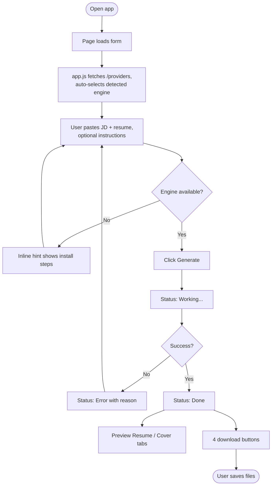

# User Flow — Resume Tailor

## Journey at a glance



## Happy path (step by step)

1. **Open** `http://127.0.0.1:8000`. The form renders with provider availability
   already marked server-side.
2. **Auto-detect.** `app.js` calls `/providers` and selects the first engine
   that's installed, updating the hint line.
3. **Fill** the job description and resume (both required); optionally add
   instructions and a model override.
4. **Submit.** The button disables, downloads/preview hide, status → *Working*.
5. **Generate.** Backend builds the prompt, calls the engine, validates the JSON
   into `TailoredDocs`, and renders four files.
6. **Respond.** Status → *Done*; four download buttons and a two-tab preview
   appear.
7. **Review & download.** User reads the preview, downloads PDF/Word as needed.

## Alternate & error paths

| # | Situation | What the user sees | Recovery |
| --- | --- | --- | --- |
| A1 | Chosen engine not installed | Hint "— not detected" + install steps; on submit, 400 with `setup_hint` | Install engine or switch to Mock |
| A2 | Empty JD or resume | 400 "Job description/Resume is empty" | Fill the required field |
| A3 | Model returns non-JSON | 400 "Model returned invalid JSON…" | Retry, or pick a stronger model |
| A4 | Engine times out | 400 with timeout message | Retry; ensure the model is pulled/loaded |
| A5 | Network error in browser | "Network error: …" | Check the server is running, retry |
| A6 | First Ollama run is slow | Status stays *Working* up to ~a minute | Wait; later runs are faster |
| A7 | Bad/expired download link | 404 | Re-generate to get fresh links |

## States the UI moves through

```
 idle  ──submit──▶  working  ──200──▶  done
                       │
                       └──4xx / network──▶  error  ──edit & resubmit──▶ working
```

- **idle** — neutral banner; downloads & preview hidden.
- **working** — amber banner; submit button disabled (cursor: progress).
- **done** — green banner; downloads + preview revealed together.
- **error** — red banner with the server's reason (pre-wrapped text).

## Entry & exit

- **Entry:** a single URL; no login, no onboarding.
- **Exit:** the user has four files saved locally. Re-running with tweaked
  instructions is encouraged and cheap (especially on Mock).
